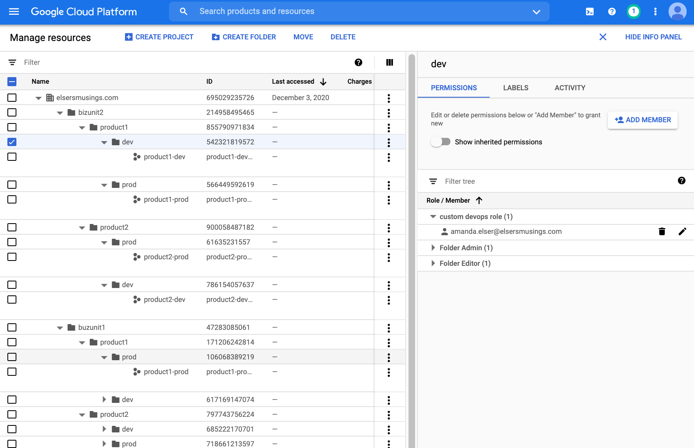

# iamfactory
This code makes the assumption you have already deployed a folder structure and after the fact want to map IAM roles to that structure. It also assumes you will logically separate each business unit into its own backend and code will live in separate repos. To fullfil the resource hierarchy pictured below you would have two instantiations of this repo.

## Repo Structure
```
SOURCE CONTROL
└── MYTEAM
    ├── bizunit1_repo
    │   └── sourcecode
    └── bizunit2_repo
        └── sourcecode
```

## Source Code Structure
In production each bizunit<ArbitraryNumber>_repo should reference back to "businessunitiamfactory" module with version pinning. So the modules directory below should be dynamically pulled from version control. Therefore you are not duplicating that code across the env and having to make changes everywhere. Users of the "businessunitiamfactory" module can then just consume it while passing in their respective [JSON Config](./bizunit.json)
```
├── README.md
├── bizunit.json
├── data.tf
├── main.tf
├── modules
│   └── businessunitiamfactory
│       ├── data.tf
│       ├── main.tf
│       ├── modules
│       │   ├── level2iamfolderfactory
│       │   │   ├── data.tf
│       │   │   ├── main.tf
│       │   │   ├── output.tf
│       │   │   └── variables.tf
│       │   └── level3iamfolderfactory
│       │       ├── data.tf
│       │       ├── main.tf
│       │       ├── output.tf
│       │       └── variables.tf
│       ├── output.tf
│       └── variables.tf
├── terraform.tfstate
├── terraform.tfstate.backup
├── terraform.tfvars
└── variables.tf
```

## GCS Structure for Terraform Backend
```
GCS Project ROOT
└── PROJECTID-terraform-state
    ├── bizunit1_repo
    │   └── default.tfstate
    └── bizunit2_repo
        └── default.tfstate
```

## Terraform Backend Example
This pattern repeats itself. The top level bucket is created using the PROJECTID with child folders reflecting the name from their origin repo name. Inside each child/prefix bucket lives tfstate.
```
terraform {
  required_version = "<VERSION>
  backend "gcs" {
    bucket = <PROJECTID-terraform-state>
    prefix =  <bizunit1_repo>
  }
}
```

## Data model
Creating custom object makes passing values through modules easier instead of having to write complex object deconstruction code this code passes the static object in its deconstructed form to modules to leverage the module ability to execute for_each on object. You can see the pattern as each modules calls another nested module deconstructing the object within scope.
```
variable business_unit {
  type = object({
    name = string
    folder_id = number
    bizunit_level1_iam_bindings = list(object({
        role = string
        members = list(string)
    }))
    components = list(object({
      name = string
      folder_id = number
      component_level2_iam_bindings = list(object({
        role = string
        members = list(string)
      }))
      environment_level3_iam_bindings = list(object({
        name = string
        folder_id = number
        iam_bindings = list(object({
          role = string
          members = list(string)
        }))
      }))
    }))
  })
}
```

## Resource Hierarchy
