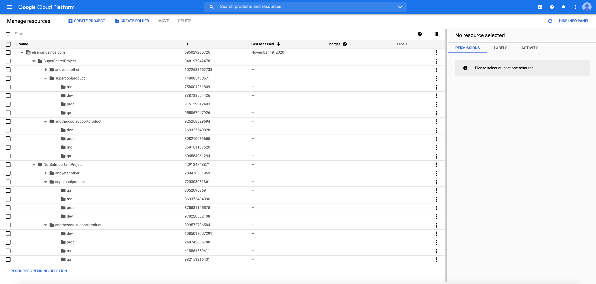

# iamfactory
This was started to quickly prototype customer organization to start mapping iam polcies etc at scale. Along the way a pattern emerged. This project will serve the security team as a baseline to test and validate security configurations in their own organizations. Lessons learned will be folded back into this configuration. Based on our learnings we hope to provide a template enterprise customers can consume and easily operationlize using GCP best practices. 

## Philosophy 
An organizations security team's maturity is graded in part by their ability to operationalize IaC. The most fundamental being Org structure and IAM policy. This project is going to attempt to achieve those ends while adhearing to good software development principles. In order to do that we will have to be opinionated at times and force others to adopt our model while keeping an open mind and have the ability to quickly modify the code according to feedback from the crowd. 

## Resource Hierarchy

## To do
- Validate project provision
    - api's enabled
    - Billing enabled
    - etc.
- Design best method to bind new custom roles to projects
- Incorporate/implement Org security policy 

## Relevant Things to Note
- A folder holding a project that is created outside of terraform will not be destroyed
- Resources are the things that projects are made of 
- Terraform by itself is not a security tool (only when used in conjunction with operational controls)
- The methodology of creating an entire organizational structure with base projects is great from a security stand point. This would require further secuirty controls in place to fully leverage the assurance that the reality is what the master terrafrom state managing those projects states. For example: A org that uses the method suggested in this repo would need to implement org wide controls only allowing a terraform service account to add projects outside orginial declaration. This is needed because terraform has no way of detecting drift of resources created outside of its configuration. 
- Key questiond that need answered in order to operationalize would be:
    1. Who needs to create projects?
    2. What scenerio would present this approach too rigid and not beneficial?
- Benefits of this approach
    1. Security is baked into project creation/kick-off
        - IAM
        - API's enabled 
        - Central management of project creation 
        - Confidence/assurance in 
    2. Single source of truth of projects IAM bindings and enabled API's

